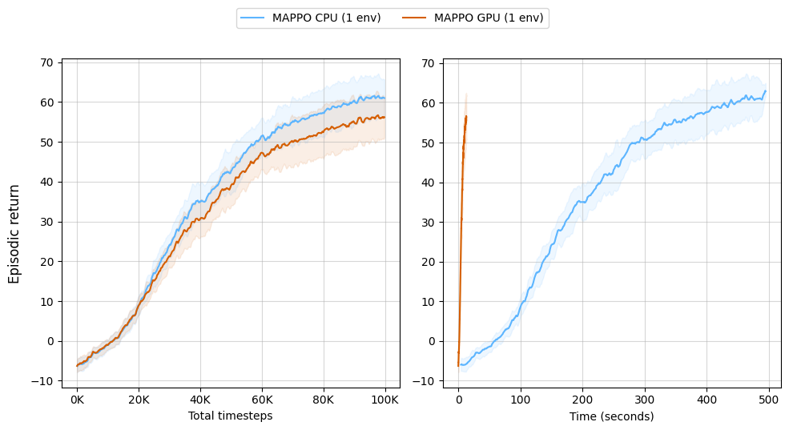

[](https://pre-commit.com/)
[](https://github.com/psf/black)
[](https://pycqa.github.io/isort/)


# CrazyRL

:warning: Work in progress, suggestions are welcome. :warning:

A hardware-accelerated library for doing Multi-Agent Reinforcement Learning with [Crazyflie](https://www.bitcraze.io/products/crazyflie-2-1/) drones.

It has:

* ⚡️ A lightweight and fast simulator that is good enough to control [Crazyflies](https://www.bitcraze.io/products/crazyflie-2-1/) in practice;
* 🤝 A set of environments implemented in Python and Numpy, under the [PettingZoo](https://pettingzoo.farama.org/) parallel API;
* 🚀 The same environments implemented in [Jax](https://github.com/google/jax), that can be run fully on GPU;
* 🧠 MARL algorithms implemented in Jax, both for PettingZoo and for full Jax environments;
* 🚁 A set of utilities based on the [cflib](https://www.bitcraze.io/documentation/repository/crazyflie-lib-python/master/api/cflib/) to control actual Crazyflies;
* ✅ Good quality, tested and documented Python code;


The real-life example shown in the video is the result of executing the policies in real-life after learning in the lightweight simulator. The learning was performed by with [MASAC](https://github.com/ffelten/MASAC). Once the environment trained it can be displayed on simulation environment or in reality with the [Crazyflies](https://www.bitcraze.io/products/crazyflie-2-1/).

## Environments

The red balls represent the position of the controlled drones.

[//]: # (### Hover)

[//]: # ()
[//]: # (The drones learn to hover in a fixed position.)

[//]: # ()
[//]: # ()

[//]: # ()
[//]: # (The yellow balls represent the target position of the drones.)

[//]: # ()
[//]: # (Available in [Numpy]&#40;crazy_rl/multi_agent/numpy/hover/hover.py&#41; and [JAX]&#40;crazy_rl/multi_agent/jax/hover/hover.py&#41; version.)

### Circle
The drones learn to perform a coordinated circle.


The yellow balls represent the target position of the drones.

Available in [Numpy](crazy_rl/multi_agent/numpy/circle/circle.py) and [JAX](crazy_rl/multi_agent/jax/circle/circle.py) version.

### Surround
The drones learn to surround a fixed target point.


The yellow ball represents the target the drones have to surround.

Available in [Numpy](crazy_rl/multi_agent/numpy/surround/surround.py) and [JAX](crazy_rl/multi_agent/jax/surround/surround.py) version.

### Escort
The drones learn to escort a target moving straight to one point to another.


The yellow ball represents the target the drones have to surround.

Available in [Numpy](crazy_rl/multi_agent/numpy/escort/escort.py) and [JAX](crazy_rl/multi_agent/jax/escort/escort.py) version.

### Catch
The drones learn to catch a target trying to escape.


The yellow ball represents the target the drones have to surround.

Available in [Numpy](crazy_rl/multi_agent/numpy/catch/catch.py) and [JAX](crazy_rl/multi_agent/jax/catch/catch.py) version.

## Learning
We provide implementations of MAPPO [1] both compatible with a CPU env (PettingZoo parallel API), and a GPU env (our JAX API). These implementations should be very close to each others in terms of sample efficiency but the GPU version is immensely faster in terms of time.
We also have a multi-agent version of SAC, [MASAC](https://github.com/ffelten/MASAC), which is compatible with the CPU envs.


In the above image, we can see that sample efficiency of both MAPPO versions are very close, but the JAX version is much faster in terms of time. Notice that the Jax version can be improved further by relying on vectorized envs.

## API

There are examples of usage in the [test files](crazy_rl/test) and main methods of the environments. Moreover, the [learning](learning/) folder contains examples of MARL algorithms.

### Numpy version

Basic version which can be used for training, simulation and the real drones.
It follows the [PettingZoo parallel API](https://pettingzoo.farama.org/).

Execution :
```python
from crazy_rl.multi_agent.numpy.circle.circle import Circle

env: ParallelEnv = Circle(
    drone_ids=np.array([0, 1]),
    render_mode="human",    # or real, or None
    init_flying_pos=np.array([[0, 0, 1], [2, 2, 1]]),
)

obs, info = env.reset()

done = False
while not done:
    # Execute policy for each agent
    actions: Dict[str, np.ndarray] = {}
    for agent_id in env.possible_agents:
        actions[agent_id] = actor.get_action(obs[agent_id], agent_id)

    obs, _, terminated, truncated, info = env.step(actions)
    done = terminated or truncated
```

You can have a look at the `learning/` folder to see how we execute pre-trained policies.

### JAX version

This version is specifically optimized for GPU usage and intended for agent training purposes.
However, simulation and real-world functionalities are not available in this version.

Moreover, it is not compliant with the PettingZoo API as it heavily relies on functional programming.
We sacrificed the API compatibility for huge performance gains.

Some functionalities are automatically done by wrappers, such as `vmap`, enabling parallelized training, allowing to leverage  all the cores on the GPU.
While it offers faster performance on GPUs, it may exhibit slower execution on CPUs.

You can find other wrappers you may need defined in [jax_wrappers](crazy_rl/utils/jax_wrappers.py).

Execution:

```python
from jax import random
from crazy_rl.multi_agent.jax.circle.circle import Circle

parallel_env = Circle(
        num_drones=5,
        init_flying_pos=jnp.array([[0.0, 0.0, 1.0], [2.0, 1.0, 1.0], [0.0, 1.0, 1.0], [2.0, 2.0, 1.0], [1.0, 0.0, 1.0]]),
        num_intermediate_points=100,
    )

num_envs = 3  # number of envs in parallel
seed = 5  # PRNG seed
key = random.PRNGKey(seed)
key, subkeys = random.split(key)
subkeys = random.split(subkeys, num_envs)

# Wrappers
env = AutoReset(env)  # Auto reset the env when done, stores additional info in the dict
env = VecEnv(env)  # Vectorizes the env public methods

obs, info, state = env.reset(subkeys)

# Example of stepping through the 5 parallel environments
for i in range(301):
    actions = jnp.zeros((num_envs, parallel_env.num_drones, parallel_env.action_space(0).shape[0]))
    for env_id, obs in enumerate(obs):
        for agent_id in range(parallel_env.num_drones):
            key, subkey = random.split(key)
            actions[env_id, agent_id] = actor.get_action(obs, agent_id, subkey) # YOUR POLICY HERE

    key, *subkeys = random.split(key, num_envs + 1)
    obs, rewards, term, trunc, info, state = env.step(state, actions, jnp.stack(subkeys))

    # where you would learn or add to buffer
```


## Install & run

### Numpy version
```shell
poetry install
poetry run python crazy_rl/multi_agent/numpy/circle/circle.py
```

### JAX on CPU

```shell
poetry install
poetry run python crazy_rl/multi_agent/jax/circle/circle.py
```

### JAX on GPU

JAX GPU support is not included in the [pyproject.toml](pyproject.toml) file, as JAX CPU is the default option.
Therefore, you need to manually install JAX GPU and disregard the poetry requirements for this purpose.

```shell
poetry install
poetry shell
pip install --upgrade pip

# Using CUDA 12
pip install --upgrade "jax[cuda12_local]" -f https://storage.googleapis.com/jax-releases/jax_cuda_releases.html

# Or using CUDA 11
pip install --upgrade "jax[cuda11_local]" -f https://storage.googleapis.com/jax-releases/jax_cuda_releases.html

python crazy_rl/learning/mappo.py
```

Please refer to the [JAX installation GitHub page](https://github.com/google/jax#installation) for the
specific CUDA version requirements.

After installation, the JAX version automatically utilizes the GPU as the default device. However, if you
prefer to switch to the CPU without reinstalling, you can manually set the device using the following command:

```python
jax.config.update("jax_platform_name", "cpu")
```

## Modes
### Simulation

`render_mode = "human"`

The simulation is a simple particle representation on a 3D cartesian reference based on Crazyflie [lighthouse reference frame](https://www.bitcraze.io/documentation/repository/crazyflie-firmware/master/functional-areas/lighthouse/terminology_definitions/).
It is sufficient since the control of the CrazyFlies is high-level and precise enough.

Available in the Numpy version.

### Real

`render_mode = "real"`

In our experiments, positioning was managed by [Lighthouse positioning](https://www.bitcraze.io/documentation/system/positioning/ligthouse-positioning-system/).
It can probably be deployed with other positioning systems too.

Available in the Numpy version.

#### Guidelines

Firstly configuration of the positioning system has to be saved in a config file using the [cfclient app](https://www.bitcraze.io/documentation/repository/crazyflie-clients-python/master/userguides/userguide_client/). We have a script which does that in [geometry.py](crazy_rl/utils/geometry.py). You have to run it for each drone id, e.g. `python geometry.py geometry.yaml 1,2,4 0`.

Secondly place the turned on drones on your environment, on the ground below the positions given to `init_flying_pos` in your code. Be careful to put your drones at their right place depending on their id to avoid any crash at start up.

#### Tips

Verify also that the LEDs on drones aren't red: it means the drone have not enough battery to pursue the mission.

The LED on lighthouse deck have to be green to ensure a good reception of lighthouse positioning.


## Dev infos

### Structure

The project consists of two versions, each with corresponding files located in the
[JAX directory](crazy_rl/multi_agent/jax) and the [Numpy directory](crazy_rl/multi_agent/numpy), respectively.

In the Numpy version, the switch between real environment and simulation is specified through the `render_mode`
option, can be `"real"`, `"human"` or `None`.

`BaseParallelEnv` is the base class for the environment in both versions. It contains the basic methods to
interact with the environment. From there, child classes allow to specify specific tasks such as Circle or Hover.
`utils/` contains the basic functions to interact with the drones, OpenGL stuff for rendering and wrappers which
add automatic behaviours to JAX version.

You can explore the [test files](crazy_rl/test) to gain examples of usage and make comparisons between the
Numpy and JAX versions.

### Env design
The envs often try to minimize the distance towards the target of each drone. While we initially modelled this as the negative distance, it seems that PPO doesn't like having only negative reward signals. Thus, we opted for potential based rewards [2] instead.

In some cases, an additional conflicting reward is also needed: maximizing the distance towards the other drones. Both rewards are then linearly combined using weights which pre-defined. To find the weights, we used a multi-objective technique consisting in exposing the rewards as vectors and let the learning algorithm try multiple weights (in the Jax version, it is trivially performed by `vmapping` the learning loop under a few weights). While this seems very simple, it is blazing fast because there is no coordination needed between threads.

## Related projects
* [PettingZoo](https://pettingzoo.farama.org/): MARL API and environments;
* [cflib](https://www.bitcraze.io/documentation/repository/crazyflie-lib-python/master/): Crazyflie Python library;
* [gymnax](https://github.com/RobertTLange/gymnax): RL environments in Jax, but not multi-agent;
* [PureJaxRL](https://github.com/luchris429/purejaxrl): End-to-end RL in Jax, but not multi-agent;
* [CrazyFlyt](https://github.com/jjshoots/CrazyFlyt): Simulation and real life control of Crazyflies, the main difference with this project is that the simulator is an actual, heavyweight simulator (Pybullet). Hence, it does not have a full jax version. It is in practice more fit for learning controllers, while our project focuses on learning swarm formation.

## Citation
If you use this code for your research, please cite this using:

```bibtex
@misc{crazyrl,
    author = {Florian Felten and Coline Ledez and Pierre-Yves Houitte and El-Ghazali Talbi and Grégoire Danoy},
    title = {CrazyRL: A Multi-Agent Reinforcement Learning library for flying Crazyflie drones},
    year = {2023},
    publisher = {GitHub},
    journal = {GitHub repository},
    howpublished = {\url{https://github.com/ffelten/CrazyRL}},
}
```

## Bibliography
[1] C. Yu et al., “The Surprising Effectiveness of PPO in Cooperative Multi-Agent Games,” presented at the Thirty-sixth Conference on Neural Information Processing Systems Datasets and Benchmarks Track, Jun. 2022. Accessed: Sep. 05, 2023. [Online]. Available: https://openreview.net/forum?id=YVXaxB6L2Pl

[2] A. Ng, D. Harada, and S. J. Russell, “Policy Invariance Under Reward Transformations: Theory and Application to Reward Shaping,” presented at the International Conference on Machine Learning, Jun. 1999. Accessed: Aug. 10, 2023. [Online]. Available: https://www.semanticscholar.org/paper/Policy-Invariance-Under-Reward-Transformations%3A-and-Ng-Harada/94066dc12fe31e96af7557838159bde598cb4f10
