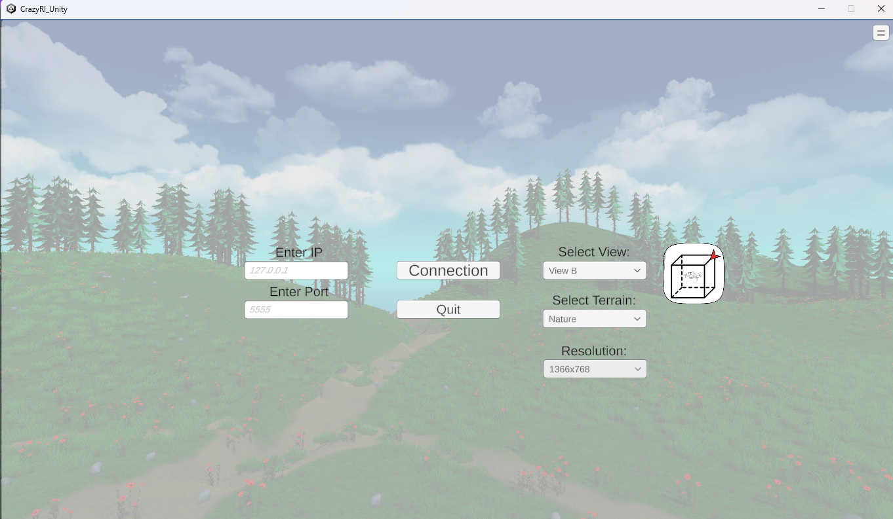
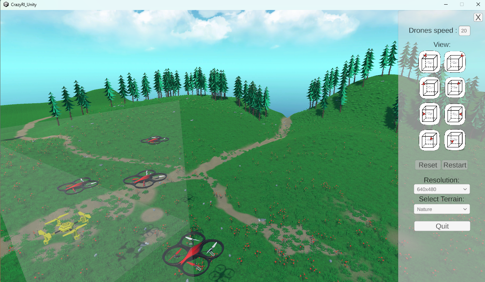
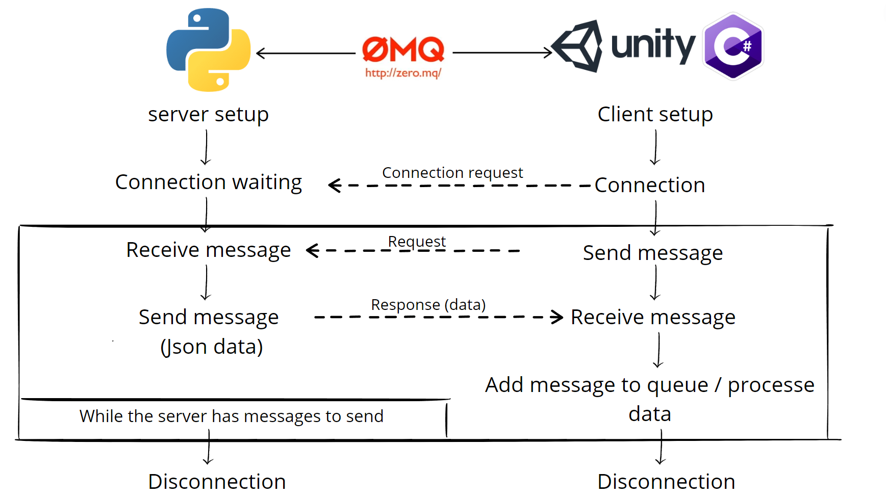

# CRAZYRL UNITY

CrazyRL Unity is a [Unity](https://unity.com/fr) project for building rendering engine of CrazyRL.

## Overview

This project is used for the `render_mode = "unity"` simulation of the [CrazyRL project.](https://github.com/ffelten/CrazyRL) It includes a Unity project for visual simulation, scripts for server-client communication, and executables for running the simulation on Linux and Windows.

## Project Contents

- Unity Project: Located in the folder crazy_rl_unity
    - C# Scripts: [crazy_rl_unity/Assets/Script](https://github.com/ffelten/CrazyRL/tree/main/crazy_rl_unity/Assets/Script)
    - Drone Prefabs:  [crazy_rl_unity/Assets/Prefab](https://github.com/ffelten/CrazyRL/tree/main/crazy_rl_unity/Assets/Prefab)
    - Terrains: [crazy_rl_unity/Assets/Environnements](https://github.com/ffelten/CrazyRL/tree/main/crazy_rl_unity/Assets/Environnements)
    - Packages: NuGet, JSON, and ZMQ packages are used for the client-server part of the project.
- Executables: (Linux and Windows) located in the folder [crazy_rl/multi_agent/numpy/bin](https://github.com/ffelten/CrazyRL/tree/main/crazy_rl/multi_agent/numpy/bin)

## Running the Application on Different Operating Systems

By default, the application runs on Linux. If you want to run it on Windows, comment out line *subprocess.Popen("./crazy_rl/multi_agent/numpy/bin/unity/Linux/CrazyRlUnity.x86_64")* and uncomment line *subprocess.Popen("./crazy_rl/multi_agent/numpy/bin/unity/Window/CrazyRl_Unity.exe")* in the send_to_unity() function in [base_parallel_env.py](https://github.com/ffelten/CrazyRL/blob/main/crazy_rl/multi_agent/numpy/base_parallel_env.py).

## Features

### Connection Menu

- Connection Settings: Change the IP and port used for communication with the server. By default, the IP address is *127.0.0.1* and the port is *5555*.
    - If you want to  to change the IP address and port, modify these in the send_to_unity() function in [base_parallel_env.py](https://github.com/ffelten/CrazyRL/blob/main/crazy_rl/multi_agent/numpy/base_parallel_env.py) and enter the same IP and port in the input fields of the connection menu.
    - If you want to change the default IP address and port, modify these in the send_to_unity() function in [base_parallel_env.py](https://github.com/ffelten/CrazyRL/blob/main/crazy_rl/multi_agent/numpy/base_parallel_env.py) and modify the ip and port attributes of the Client class in [Client.cs](https://github.com/ffelten/CrazyRL/tree/main/crazy_rl_unity/Assets/Script/Client.cs)

- Connection Button: Connect to the server and access the simulation scene.

- Camera Settings: Set the camera's view angle using the dropdown menu. The icon changes based on the selected view, with the red arrow representing the camera direction.

- Terrain Change: Switch the environment (natural or industrial) using the dropdown menu.

- Application Window Resolution: Change the application window's resolution using the dropdown menu.

- Quit Button: Exit the application

### Simulation Scene

- Zoom: Zoom in or out on the drones using the mouse wheel.

- Access Options Menu: Open the options menu using the button at the top right.

### Options Menu

- Drones speed: Set the speed of the drones using input field.

- Camera Settings: Change the camera's view angle using the buttons. The red arrow on the icon represents the camera direction.

- Restart: Restart the simulation by first pressing the reset button (repositions the drones to their initial positions) and then the restart button (resumes the simulation).

- Application Window Resolution: Change the application window's resolution using the dropdown menu.

- Terrain Change: Switch the environment (natural or industrial) using the dropdown menu.

- Quit Button: Exit the application without causing it to crash.

## Modifications

1. Open the crazy_rl_unity folder in UnityHub.
2. Make the desired modifications.
3. Save the executable in the folder crazy_rl/multi_agent/numpy/bin.
4. Modify the path in the subprocess.Popen(*path to the executable*) function within the send_to_unity() function of the script crazy_rl/multi_agent/numpy/base_parallel_env.py.

## Client Serveur Communication

Client-server communication is provided by the ZMQ (ZeroMQ) library. The server sends instructions to the Unity simulation, and the simulation processes the data.

### Data Received by the Client

The data received by the client contains:

- isInstantiate (bool): true if the drone is instantiated, false if the drone is not instantiated.
- nbDrone (int): Number of drones present in the scene (targets not included).
- size (int): Size of the simulation area.
- id (int): Identifier of the drone.
- posX (float): X coordinate of the drone.
- posY (float): Y coordinate of the drone.
- posZ (float): Z coordinate of the drone.
- str (string): Message to correctly process the sent data.

## Pre-Commit Formatting

We use CSharpier for pre-commit formatting of our C# code to ensure consistent code style and formatting. Make sure to have:

- [.NET8 SDk](https://dotnet.microsoft.com/en-us/download/dotnet/8.0) : `apt update && sudo apt install -y dotnet-sdk-8.0`
- [Csharpier](https://csharpier.com/docs/Installation) : `dotnet tool install csharpier`
